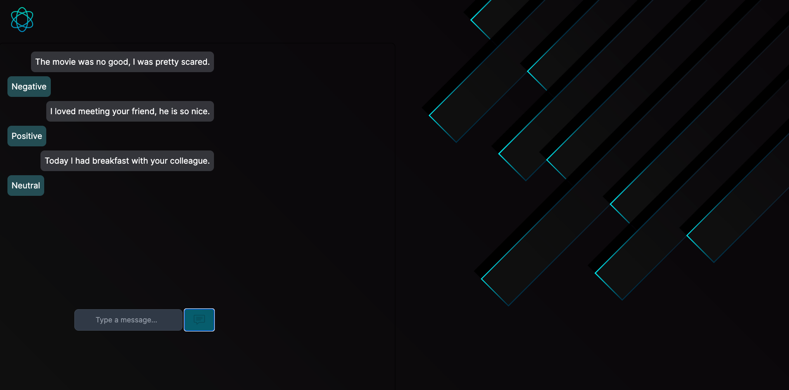

# Chat Application with Sentiment Analysis

This is a simple chat application that allows users to send messages to a backend server. The backend server, implemented using Flask, performs sentiment analysis on the received messages to determine whether they are positive, negative, or neutral. The sentiment analysis is done using the TextBlob library.

## Features

- Users can type and send messages in the chat interface.
- The chat messages are displayed in a conversation-like format.
- The backend server analyzes the sentiment of the messages and responds with the sentiment result.

## Technologies Used

- React: Frontend user interface.
- Next.js: Framework for server-rendered React applications.
- Flask: Backend server framework.
- TextBlob: Natural language processing library for sentiment analysis.

## Project Purpose

The primary purpose of this project is **not** the sentiment analysis itself, but rather to provide a simple and functional chat application as a foundation for future projects. It serves as a starting point for building more advanced chat applications or integrating sentiment analysis into larger systems.

## Run 

In order to run the project: 
- Run `npm run dev` so that the frontend gets setted up .
- Run `python3 server.py` so that the backend listens the POST requests from the backend.
